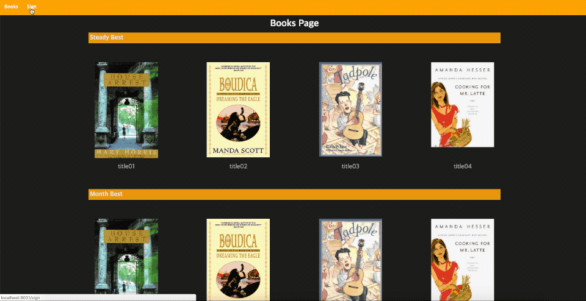
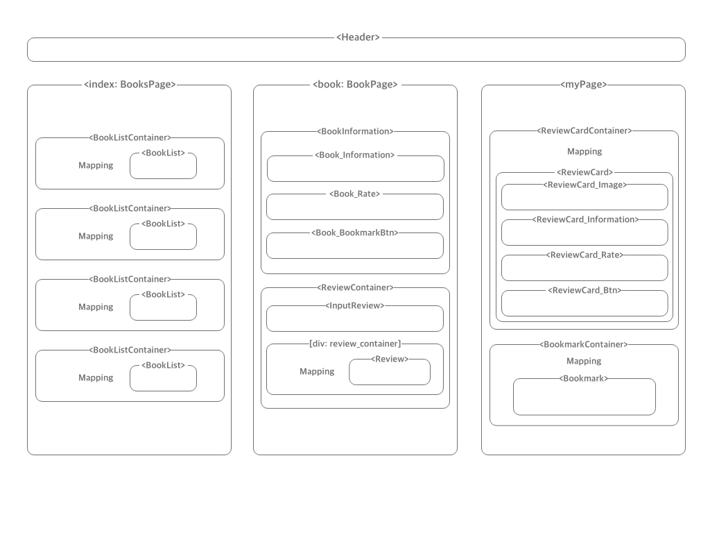
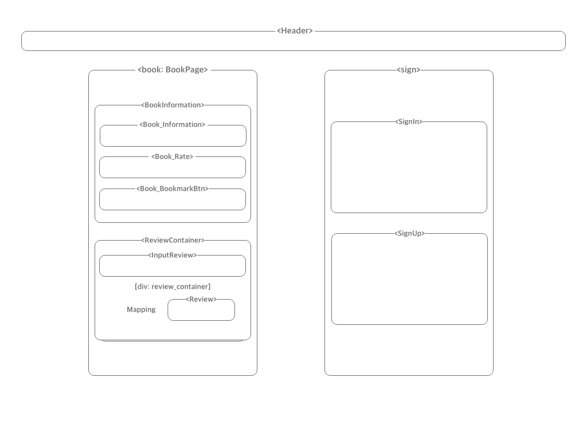

# Booker

## Web page size

## Tablet and Mobile page size

## Technical Stack

### Front
1. React.js
2. Next.js
3. Node.js

### Back
1. Express.js
2. Mysql
3. Sequelize

## Features
1. Next.js 라이브러리를 이용해서 서버사이드 랜더 구현.
2. 유저가 리뷰를 작성하고 마이페이지에서 모아서 볼 수 있다.
3. 유저가 보고싶은 책을 북마크 할 수 있다.
4. 유저가 특정한 리뷰를 수정하고 싶은 경우 수정 페이지에서 수정할 수 있다.
5. 반응형으로 디자인하여 웹 브라우져, 태블릿, 모바일 환경에서도 동일한 기능을 사용할 수 있다.
6. 모달창으로 유저의 의사를 확인하고 그 의사에 따라 명령이 실행된다.
7. 중복되는 리뷰, 북마크 요청이 있는 경우 서버에서 deny response를 준다.

## Components Structure

